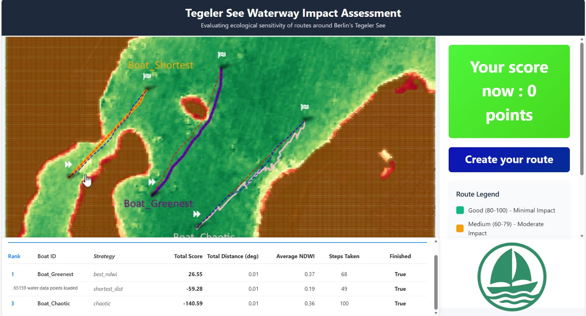

# Waterway Travel Project 🚤 🇪🇺

> **Redefining European waterway travel with EU Space Innovation.**

[](https://www.euspa.europa.eu/)
[](LICENSE)
[](https://www.python.org/)
[](https://vscode.dev/redirect?url=vscode://ms-vscode-remote.remote-containers/cloneInVolume?url=https://github.com/azizisahand/European-waterway-travel-with-EU-Space-Innovation)

**This Project** turns waterway management into a participatory game powered by EU Space data. We visualize congestion and environmental sensitivity in real-time, rewarding eco-efficient navigation with **Civic Credits**.

---

## 📽️ Project Demo


*Above: Final simulation visualization showing optimal (dashed) vs. simulated (solid) routes based on NDWI data.*


**Watch the Summary Video**

https://github.com/user-attachments/assets/977ee5af-cc6e-4b43-8af5-74d792063d53

**View Presentation**

https://github.com/user-attachments/assets/1d608e3d-7abb-42b7-b119-c9bc7e3d76e9


---

## 🚀 The Challenge & Solution

**Challenge 3: Beyond Horizons** — Redefining Travel with Space Innovation.

### The Problem
European waterways are managed with outdated models. Congestion, noise, and ecological strain clash with logistics and tourism. Travelers rarely see their environmental impact, and cities lack dynamic tools to manage flow sustainability.

### The Solution
Race_Publica fuses **Copernicus** and **Galileo** data streams into a live environmental scoring engine.
1.  **Analyze:** We map water quality (NDWI) and sensitivity using Sentinel-2.
2.  **Gamify:** Participants earn *Civic Credits* for choosing green routes and respecting sensitive zones.
3.  **Reward:** Credits are redeemed for toll discounts or carbon offsets, creating a commons economy for urban waterways.

---

## 🛰️ Use of EU Space Technologies

Our engine is built on the backbone of European space infrastructure:

* **Copernicus Sentinel-2:** Supplies NDWI (Normalized Difference Water Index) and NDVI imagery to classify eco-zones by environmental sensitivity.
* **Galileo GNSS:** (Simulated) Provides high-precision vessel geolocation for congestion and flow mapping.
* **Copernicus Climate Data Store:** Adds contextual layers (water levels, temperature) for dynamic scoring.

---

## ⚙️ Technical Architecture

The project consists of three core components:

### 1. The Simulation Engine (`simulation_engine.ipynb`)
A Jupyter Notebook that processes satellite imagery and simulates vessel movement.
* **Data Processing:** Downloads Sentinel-2 L2A data via SentinelHub.
* **Graph Building:** Converts waterways (OSM) and Water/Land masks into a navigable network graph.
* **Pathfinding:** Calculates three route types: *Shortest* (Time prioritized), *Greenest* (NDWI prioritized), and *Chaotic* (Randomized).

### 2. NDWI & Speed Scoring
Calculates eco-scores per vessel based on:
* $Score_{NDWI}$: Higher scores for traversing clean, deep water.
* $Score_{Dist}$: Penalties for excessive distance.
* $Score_{Time}$: Penalties for congestion delays.

### 3. Streamlit Dashboard
An interactive frontend that allows users to visualize the scored zones and boat movements on a map of Berlin (and scalable to other EU cities).

---

## 📸 System Visualizations

### Step 4: True Color Acquisition
Retrieving RGB Sentinel-2 imagery for the Berlin AOI.


### Step 5: Land-Water Classification
Inverting Waterway polygons to create Landmass exclusion zones for the routing graph.


### Step 7: Environmental Sensitivity Map
Generating the NDWI Heatmap to identify sensitive ecological corridors.


---

## 💻 Getting Started

### Local Installation

1.  **Clone the repository**
    ```bash
    git clone [https://github.com/azizisahand/European-waterway-travel-with-EU-Space-Innovation.git](https://github.com/azizisahand/European-waterway-travel-with-EU-Space-Innovation.git)
    cd European-waterway-travel-with-EU-Space-Innovation
    ```

2.  **Install Dependencies**
    ```bash
    pip install -r requirements.txt
    ```

3.  **Run the Simulation Engine**
    Open `simulation_engine.ipynb` in Jupyter Lab or VS Code.
    * **Note:** You will need Sentinel Hub credentials configured in the environment setup cell.

---

## 🔮 Impact & Next Steps

* **Expansion:** Extend analysis to Venice, Amsterdam, Vienna, Budapest, and Belgrade.
* **Integration:** Incorporate AIS telemetry for predictive routing.
* **Civic Credits:** Pilot the token rewards system with local tourism boards.

> *"We believe in a philosophy where the Earth is our mother whose waterways are her arteries and our wealth, material and spiritual, moves through them."*

---

## 🤝 Contact

For any questions or feedback, feel free to reach out:

<p align="center">
  <a href="https://www.linkedin.com/in/sahandazizi/">
    
  </a>
  &nbsp;&nbsp;

  <a href="https://github.com/azizisahand">
    
  </a>
</p>

*Built for the EU Space Hackathon. 2025 Berlin.*[**Race_Publica**](https://taikai.network/cassinihackathons/hackathons/eu-space-consumer-experience/projects/cmhlnlclc00zixv32a92us6jb/idea)
